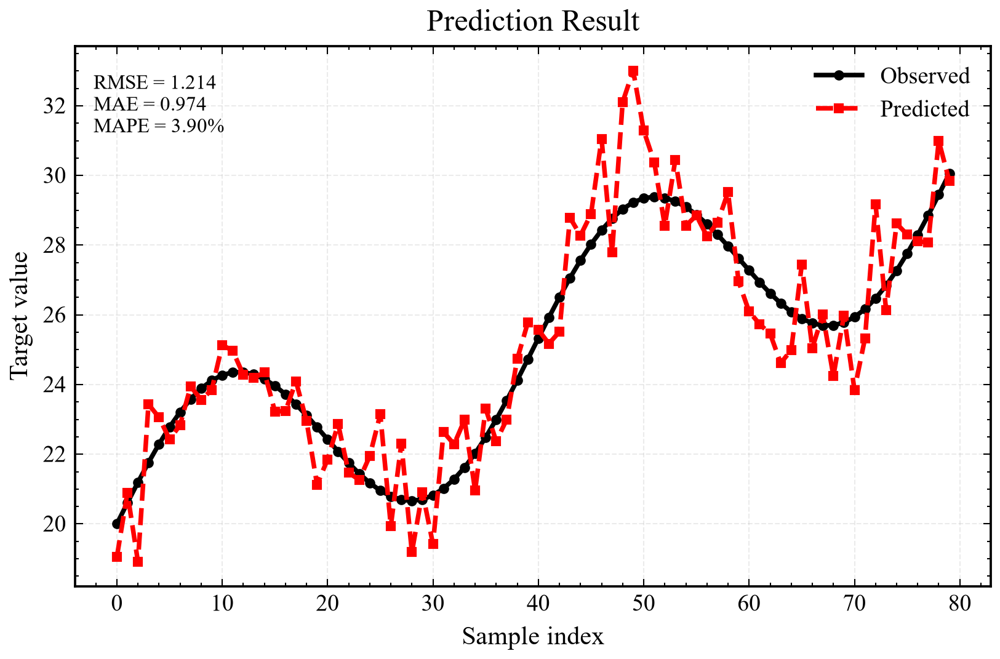
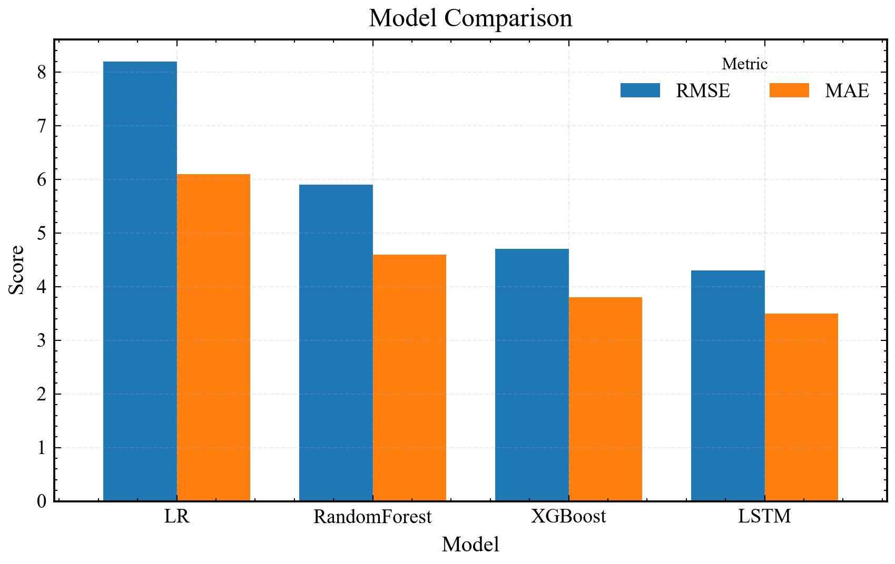
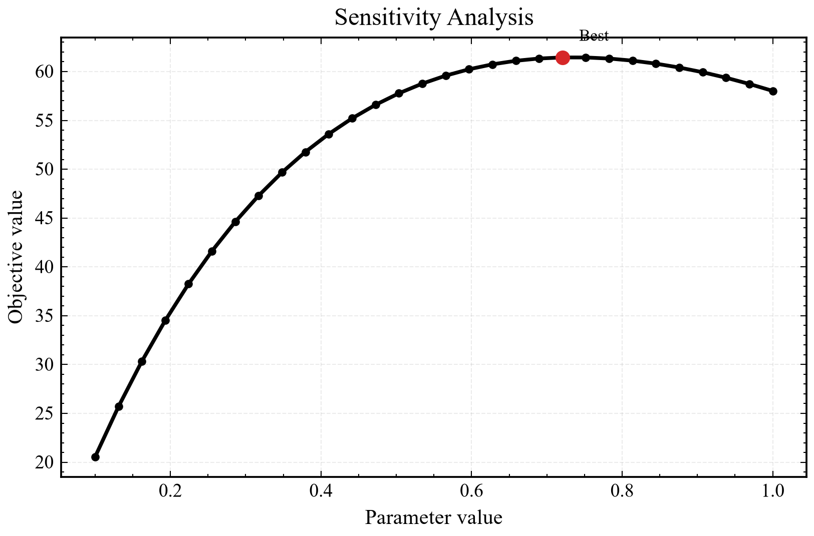
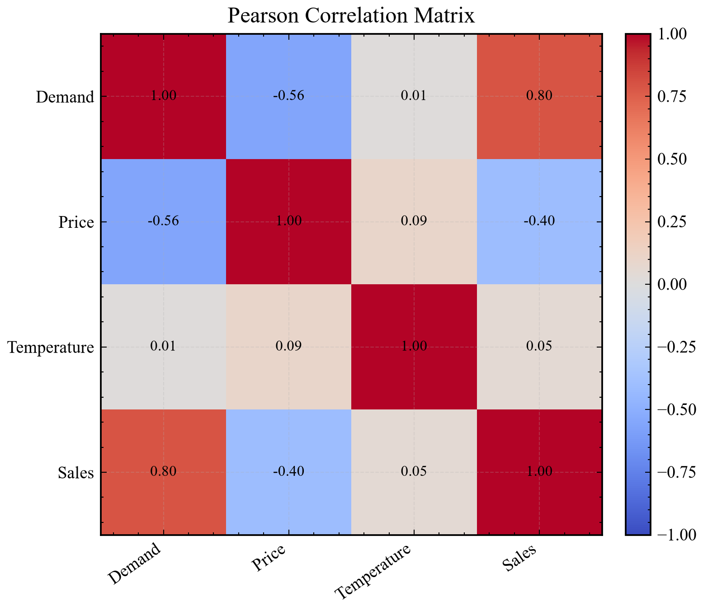
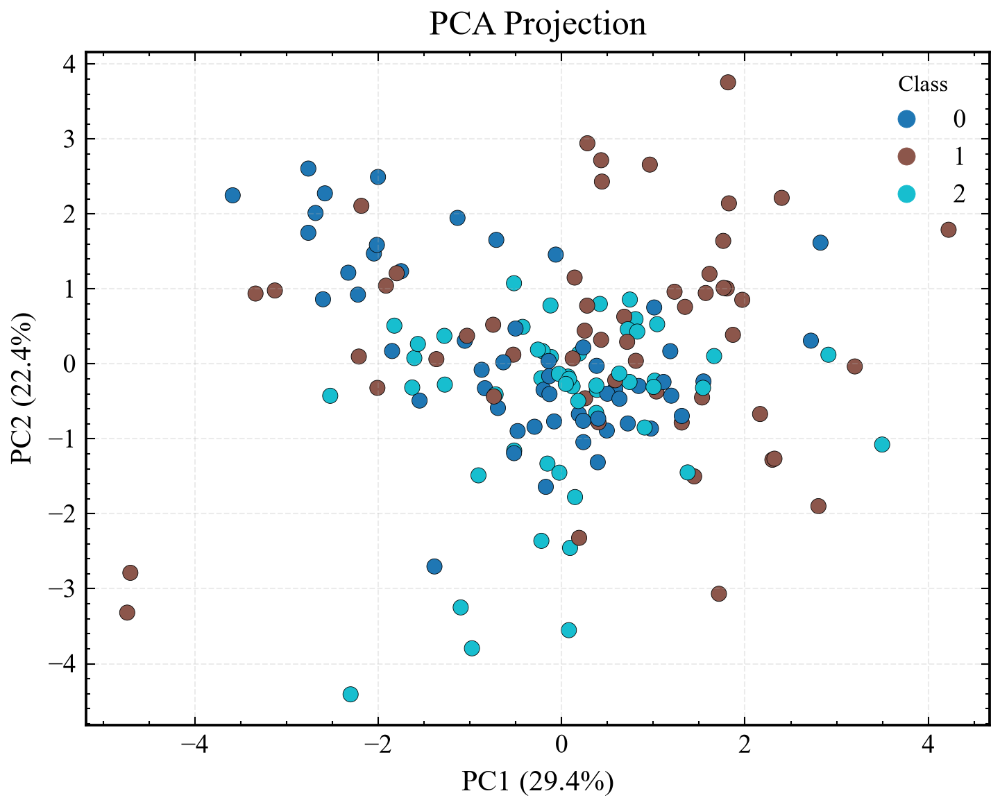
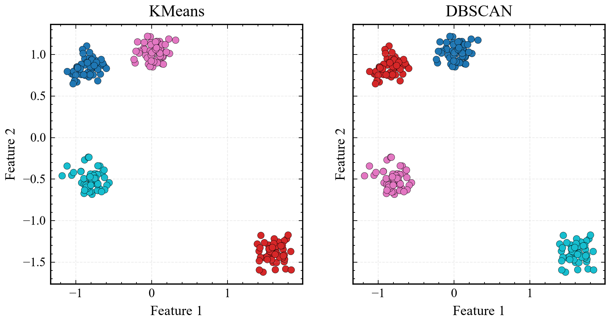

# MathModel-Figure-Toolkit

科研级数学建模论文绘图与可视化模板库，面向全国大学生数学建模竞赛（CUMCM/MCM）的 48 小时高强度建模、实验和论文写作流程。

本项目不是重新发明一套普通绘图库，而是把成熟开源项目和科研论文视觉经验整理成比赛中可以直接复用的“图形基础设施”。

## 为什么创建

数学建模比赛中，很多队伍的模型并不弱，但论文图表常见几个问题：

- 图像风格不统一，论文像多份截图拼接。
- 结果图只有默认样式，缺少科研论文质感。
- 流程图、框架图临时手画，结构不清。
- 代码、图、论文之间没有稳定复用关系。

本工具库的目标是：让建模队伍在比赛中快速产出清晰、统一、可编辑、适合论文排版的图形资产。

## 参考项目与设计来源

- [SciencePlots](https://github.com/garrettj403/SciencePlots)：matplotlib 科研论文风格，IEEE/Nature 风格绘图。
- [GMCMthesis](https://github.com/latexstudio/GMCMthesis)：中国数学建模论文的 LaTeX 排版、图表插入和论文结构经验。
- TikZ / PGFPlots：数学公式图、矢量插图、算法流程图。
- draw.io：可编辑流程图、系统结构图、算法框架图。
- Figma 与科研论文视觉设计经验：模型结构图、系统框架图、CVPR/IEEE/Nature 风格表达。

## 安装

建议在项目根目录创建独立环境：

```bash
python -m venv .venv
.venv\Scripts\python.exe -m pip install -r requirements.txt
```

也可以在已有数学建模环境中补装：

```bash
python -m pip install matplotlib SciencePlots numpy pandas scikit-learn
```

## 快速使用

运行预测结果图模板：

```bash
python 02_result_visualization/prediction/regression_result.py
```

运行相关性热力图模板：

```bash
python 02_result_visualization/statistics/correlation.py
```

所有 Python 模板默认输出：

- PNG，300 dpi
- SVG
- PDF

默认输出目录为各脚本同级的 `output/`。

## 目录结构

```text
MathModel-Figure-Toolkit/
├── 00_style/                 # 统一科研绘图风格
├── 01_framework_templates/   # draw.io 与 TikZ 通用框架图
├── 02_result_visualization/  # 结果图、评价图、统计图
├── 03_algorithm_flow/        # 常见算法流程图 draw.io
├── 04_common_model_templates/# 常用数学模型框架图
├── 05_paper_assets/          # 论文插图规范与 LaTeX 示例
├── 06_AI_Model_Figures/      # AI、GNN、信号处理结构图
├── 07_competition_ready_templates/ # 赛时可直接开画模板
└── examples/                 # 竞赛场景示例说明
```

## 数学建模比赛 48 小时工作流

| 时间 | 主要任务 | 推荐图形资产 |
|---|---|---|
| Hour 0-6 | Problem Analysis | `general_model_pipeline.drawio`、`data_flow.drawio` |
| Hour 6-24 | Model Construction | `optimization_framework.drawio`、`pipeline.tex` |
| Hour 24-36 | Experiment | 预测图、模型比较图、敏感性分析图 |
| Hour 36-48 | Paper Writing | 论文图注模板、LaTeX 插图模板、SVG/PDF 矢量图 |

## Python 模板清单

- 预测真实值对比图：`regression_result.py`
- 时间序列预测图：`forecasting_result.py`
- 多模型指标柱状比较图：`model_comparison.py`
- 雷达综合评价图：`radar_chart.py`
- 评价热力图：`heatmap.py`
- 敏感性分析图：`sensitivity_analysis.py`
- Pearson 相关矩阵热力图：`correlation.py`
- PCA 二维降维可视化：`PCA_visualization.py`
- KMeans / DBSCAN 聚类结果图：`clustering.py`

## 赛时优先入口

如果比赛现场时间紧，优先使用：

```text
07_competition_ready_templates/
```

这里放的是已经按赛时工作流整理过的模板：

- Python 论文级静态图
- MATLAB 高质量导出图
- 物理 / 工程类三维机制图
- 出图检查清单

外部开源项目源码统一放在：

```text
../external-tools/figure-tools/
```

外部项目用于查例子和补能力，赛时正式出图优先调用本工具库自己的模板。

## 图片展示

以下图片由模板脚本直接生成，保存在各脚本同级 `output/` 目录中。

| 场景 | 预览 |
|---|---|
| 预测结果对比 |  |
| 多模型比较 |  |
| 敏感性分析 |  |
| 相关矩阵 |  |
| PCA 降维 |  |
| 聚类结果 |  |

## draw.io 模板

draw.io 文件均为可编辑 XML 文件，可直接用 draw.io / diagrams.net 打开。

风格约束：

- 白色背景
- 黑灰主色
- 统一箭头
- 统一字体
- 不使用花哨渐变

## 论文写作建议

1. 所有图先导出 SVG 或 PDF，再插入论文。
2. 如果 Word 排版，优先使用 PNG 300 dpi。
3. 如果 LaTeX / Typst 排版，优先使用 PDF 或 SVG。
4. 一篇论文中图表字体、线宽、配色必须统一。
5. 图注不要只写“结果图”，要写清楚变量、方法和结论。

## License

MIT License。请尊重参考项目的许可证与署名要求。
