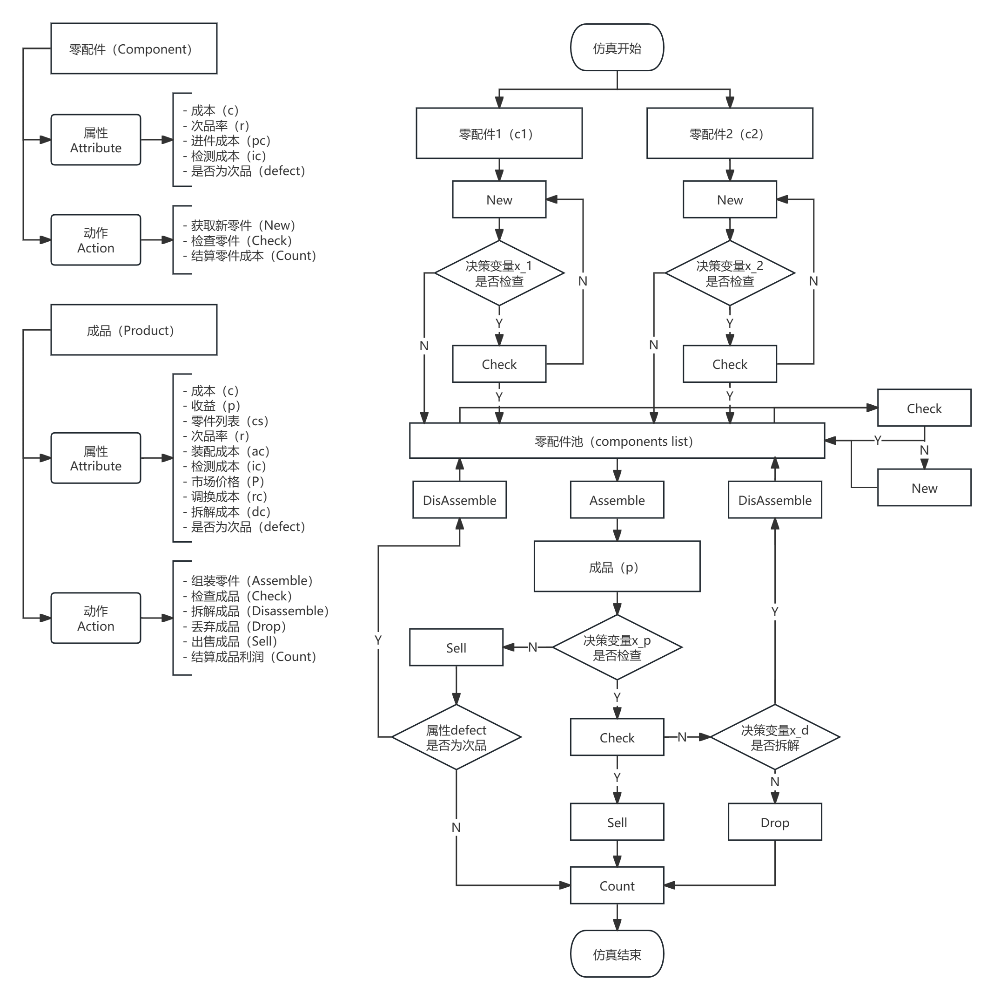
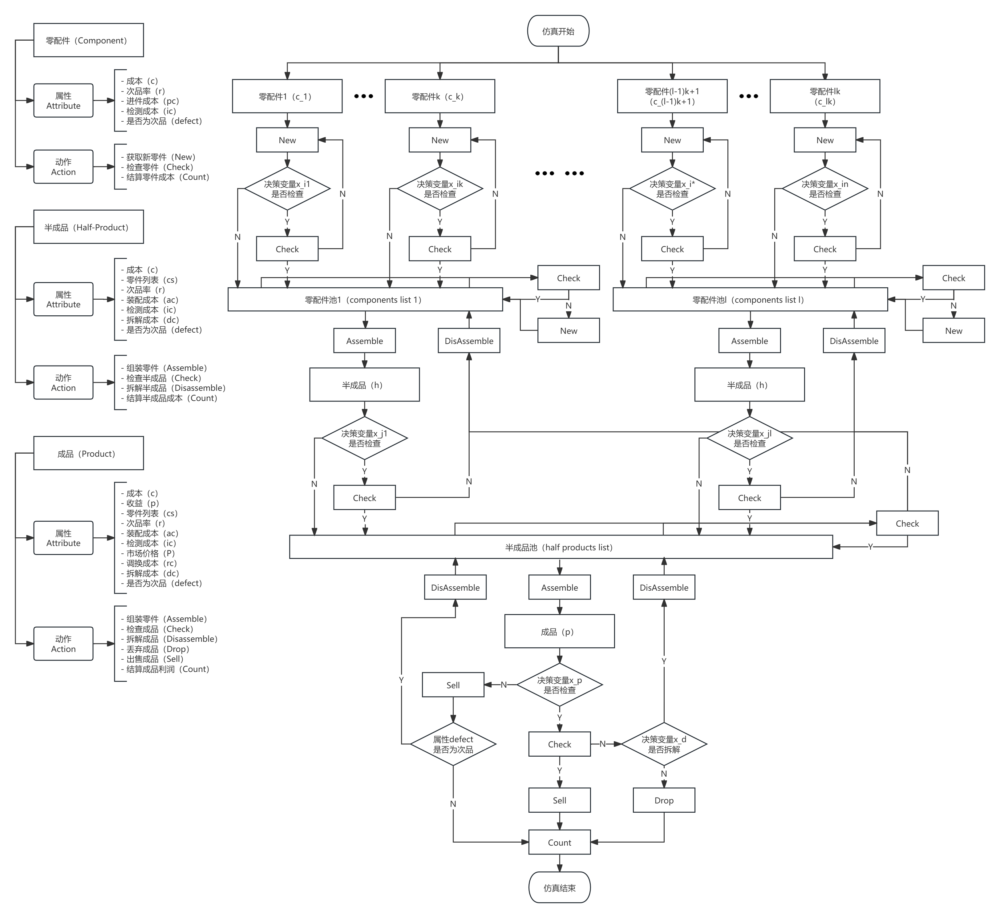

# CUMCM24-ProblemB-SimulationApproach

- 论文名称：《企业生产过程的决策优化问题》
- 获得奖项：福建赛区推荐国一、全国赛区终评国二
- 作者：顾国勤、杨子慧、吕阳
- repo作者：顾国勤

## 写在前面

这是作者的第二次数学建模国赛（大概率也是最后一次），很感谢数学建模，让我走上了数学科学和编程的世界。

第一次参赛是大一的夏天，和队友一起努力学习了数学模型、机器学习模型，苦战C题三天获得省一。

第二次参赛也就是这次，感谢我的队友，尽管暑假中没有太多磨合，我们在三天里依然配合地不错。

我会一直记得沉闷的小房间、凌晨三点雨滴落在南普陀寺莲花池的声音和最后一天怒赶ddl的紧张。

## 总体思路

对于这样一个多步、涉及多个0-1决策变量的问题，我们认为仿真计算是一个比较好的方法。

我们给出了看上去没啥问题的利润期望数学模型，以及看上去没啥问题的仿真流程，相应代码见我的repo，我们得到的结果也看上去没啥问题。（也有可能有问题但我们太菜了没有发现lol）

## 模型假设

a) **零配件供应与独立性**  
   零配件可以及时供应，且各零配件之间是否为次品相互独立。

b) **零配件检测与更换**  
   在生产过程中的任意环节，一旦检测到零配件为不合格，企业会更换一个新的零配件并重新检测，直到所需的零配件为合格件为止。该过程产生的成本将累计计算。

c) **成品拆解重装规则**  
   对于检测为不合格的成品，如果选择拆解重装，则无论之前是否对零配件进行检测，都会对拆解后的零配件进行重新检测（同假设2），直到装配所需的所有零配件均为合格件时，才继续进行成品的重装。

d) **退货品处理**  
   对于被用户退货的不合格品，企业会选择拆解重装而不是直接丢弃，以节约成本。

e) **问题三的特殊假设**  
   假设c)修改为：对于检测为不合格的半成品，一定会进行拆解重装，且无论之前是否对零配件进行检测，都会对拆解后的零配件进行重新检测，直到装配所需的所有零配件均为合格件时，才继续进行半成品的重装。对于检测为不合格的成品，如果选择拆解重装，则无论之前是否对半成品进行检测，都会对拆解后的半成品进行重新检测，直到装配所需的所有半成品均为合格件时，才继续进行成品的重装。

---

> **注：**  
> 引入假设c)和e)是为了防止决策过程递归过深。例如：假设有一个合格零配件A和一个不合格零配件B，如果始终不检测零配件B，那么由其装配的成品必然不合格。在这种情况下，若决策为检测成品并拆解不合格品，将会导致无限循环，如下图所示：

因此，通过引入假设3和5，可以有效避免死循环的发生，确保决策过程的有效性和可行性。

> 如有数学公式乱码，请将readme文件保存至本地并使用markdown软件打开。

## 问题一

我们选择了序贯抽样。

## 问题二

问题二的仿真策略如下：（在processon画布里捣鼓了好久）

首先考虑零配件成本。设第 $i$ 种零配件 $c_{i}$ 的进件成本（purchase cost）为$pc_i$、检测成本（inspection cost）为$ic_i$。该种零配件是否为次品服从二项分布 $B(n, r_i)$，其中 $r_i$ 为该种零配件的次品率（defect rate）。则其概率质量函数和期望次品率分别为：

$$
\begin{equation}
P(X = k) = \binom{n}{k} (r_i)^k (1 - r_i)^{n-k}, \quad k = 0, 1, 2, \ldots, n
\end{equation}
$$

$$
\begin{equation}
E(r_i) = r_i
\end{equation}
$$

定义决策变量 $x_i \in \{0, 1\}$ 为是否对第 $i$ 种零配件进行检测。由假设b)，考虑置换不合格品，则有零配件 $c_{i}$ 的期望成本为：

$$
\begin{aligned}
E(C_{c_{i}}) &= pc_i + x_i ic_i + x_i r_i \big[ pc_i + x_i ic_i + x_i r_i \big(pc_i + x_i ic_i + x_i r_i (\cdots)\big) \big] \\
&= pc_i + x_i ic_i + x_i r_i \frac{(pc_i + x_i ic_i)(1 - x_i^n r_i^n)}{1 - x_i r_i} \\
&= \underbrace{pc_i}_{\text{原始零配件购买成本}} + \underbrace{x_i ic_i}_{\text{零配件检测成本}} + \underbrace{x_i r_i \frac{pc_i + x_i ic_i}{1 - x_i r_i}}_{\text{替换不合格配件成本}}
\end{aligned}
$$

其次考虑成品成本。设成品$p$的装配成本（assembly cost）为$ac$、调换成本（replacement cost）为$rc$、拆解费用（disassembly cost）为$dc$。装配好的成品是否合格取决于零配件情况和装配情况：任一用于装配的零配件为次品，则成品一定为次品；用于装配的零配件均为合格品，装配出的成品是否为次品服从二项分布 $B(n, r_p)$，其中 $r_p$ 为将合格零配件装配为成品的次品率（defect rate）。

由假设b)，如果对零配件进行检测就一定会替换所检测出的次品，因此成品的期望次品率也取决于零配件是否检测，则成品 $p$ 的期望次品率为：

$$
\begin{equation}
E(r) = 1 - [1 - r_p] \prod_{i=1}^{2} [1 - r_i(1 - x_i)]
\end{equation}
$$

由零配件 $c_{i}$ 的期望成本，考虑拆解后检测$k$种零配件的情况，检测成本为（后文称之为式M，因为不会markdown语法的引用😂）：

$$
\begin{equation}
M_k = \underbrace{\sum_{i=1}^{k} \left[ ic_i + r_i \frac{(pc_i + ic_i)}{1 - r_i} \right]}_{\text{零配件检测、不合格件替换成本}}
\end{equation}
$$

定义决策变量 $x_p \in \{0, 1\}$ 为是否对成品进行检测、决策变量 $x_d \in \{0, 1\}$ 为是否对检测为不合格的成品进行拆解重装。则有成品 $p$ 的期望成本为：

$$
\begin{align}
E(C_{p}) &= ac + x_p ic_p \\
&\quad + x_p E(r) x_d \bigg\{ \bigg( dc + \sum_{i=1}^{2} \left[ ic_i + (pc_i + ic_i) \frac{r_i}{1 - r_i} \right] \bigg) \\
&\qquad \qquad + ac + x_p ic_p + x_p r_p x_d \bigg( dc + ac + x_p r_p x_d (\cdots) \bigg) \bigg\} \\
&\quad + x_p E(r) (1 - x_d)(- P) \\
&\quad + (1 - x_p) E(r) \bigg\{ \bigg( rc + dc + \sum_{i=1}^{2} \left[ ic_i + (pc_i + ic_i) \frac{r_i}{1 - r_i} \right] \bigg) \\
&\qquad \qquad + ac + x_p ic_p + x_p r_p x_d \bigg( dc + ac + x_p r_p x_d (\cdots) \bigg) \bigg\} \\
&= \underbrace{ac}_{\text{初次装配成本}} + \underbrace{x_p ic_p}_{\text{成品检测成本}}  \\
&\quad + \underbrace{x_p E(r) x_d}_{\text{拆解检测不合格成品}} \bigg\{ \underbrace{dc}_{\text{拆解成本}} + \underbrace{M_2}_{\text{式M}} + \underbrace{ac + ic_p + r_p \frac{dc + ac}{1 - r_p}}_{\text{重新装配、检测直至合格成本}} \bigg\}  \\
&\quad + \underbrace{x_p E(r) (1 - x_d)}_{\text{丢弃检测不合格成品}}\underbrace{(- P)}_{\text{无法出售的损失}} \\
&\quad + \underbrace{(1 - x_p) E(r)}_{\text{调换未检测不合格成品}} \bigg\{ \underbrace{rc}_{\text{调换成本}} + \underbrace{dc}_{\text{拆解成本}} + \underbrace{M_2}_{\text{式M}} + \underbrace{ac + x_p ic_p + x_p r_p x_d \frac{dc + ac}{1 - x_p r_p x_d}}_{\text{重新装配、检测直至合格成本}} \bigg\}
\end{align}
$$

最终得到某一成品 $p$ 完成销售和售后过程（或者丢弃）的期望收益为：

$$
\begin{equation}
E(R) = P - \sum_{i=1}^{2} E(C_{c_{i}}) - E(C_{p})
\end{equation}
$$

则问题二可以建模为非线性、有限解集的整数规划问题：

$$
\begin{alignat}{2}
\max \quad & E(R | x_i, x_p, x_d), i \in \{1, 2\}\\
s.t.\quad
& x_i, x_p, x_d \in \{0, 1\}, 
\end{alignat}
$$

## 问题三

问题三的仿真策略如下：

首先考虑零配件成本，零配件$c_i$的期望成本仍然由问题二中的定义给出。

其次考虑半成品成本。设第$j$种半成品$h_j$的装配成本（assembly cost）为$ac_j$、检测成本（inspection cost）为$ic_j$、拆解费用（disassembly cost）为$dc_j$。装配好的成品是否合格取决于零配件情况和装配情况：任一用于装配的零配件为次品，则半成品一定为次品；用于装配的零配件均为合格品，装配出的半成品是否为次品服从二项分布 $B(n, r_j)$，其中 $r_j$ 为将合格零配件装配为半成品的次品率（defect rate）。

由假设b)，由$k$个零配件组成的半成品$h_j$的期望次品率为：

$$
\begin{equation}
	E(r^*) = 1 - [1 - r_j] \prod_{i=1}^{k} [1 - r_i(1 - x_i)]
\end{equation}
$$

与问题二相同，拆解半成品后检测$k$种零配件的成本为$M_k$。

定义决策变量 $x_j \in \{0, 1\}$ 为是否对半成品进行检测、由假设e)知半成品的拆解决策与检测决策同步。则有由 $k$ 个零配件组成的半成品 $h$ 的期望成本为：

$$
\begin{align}
E(C_{h_j}) &= ac_j + x_j ic_j \\
&\quad + x_j E(r^*) \bigg\{ \bigg( dc_j + \sum_{i=1}^{k} \left[ ic_i + (pc_i + ic_i) \frac{r_i}{1 - r_i} \right] \bigg) \\
&\qquad \qquad + ac_j + x_j ic_j + x_j r_j \bigg( dc_j + ac_j + x_j r_j (\cdots) \bigg) \bigg\} \\
&= \underbrace{ac_j}_{\text{初次装配成本}} + \underbrace{x_j ic_j}_{\text{半成品检测成本}} \\
&\quad + \underbrace{x_j E(r^*)}_{\text{拆解检测不合格半成品}} \bigg\{ \underbrace{dc_j}_{\text{拆解成本}} + \underbrace{M_k}_{\text{式M}} + \underbrace{ac_j + ic_j + r_j \frac{dc_j + ac_j}{1 - r_j}}_{\text{重新装配、检测直至合格成本}} \bigg\} \\
\end{align}
$$

由假设e)，在包含$m$道生产工序的更一般生产过程情形下，上式半成品 $h$ 的期望成本依然成立。我们只需要把半成品看作可以拆解的零部件，工序就可以无限加深。

然后考虑成品成本。由假设e)，我们通过检测半成品总能确保半成品合格，由$l$个半成品装配成的成品$p$的期望次品率类似于问题二为：

$$
\begin{equation}
E(r^{**}) = 1 - [1 - r_p] \prod_{j=1}^{l} [1 - r_j(1 - x_j)]
\end{equation}
$$

考虑拆解后检测$l$种半成品的情况，半成品由$k$种零配件装配而成，检测成本为：

$$
\begin{equation}
M_l = \underbrace{\sum_{j=1}^{l} \left[ ic_j + E(r^*){dc_j + M_k + ac_j+ ic_j + r_j \frac{dc_j + ac_j}{1 - r_j}} \right]}_{\text{半成品检测、不合格品替换成本}}
\end{equation}
$$

定义决策变量 $x_p \in \{0, 1\}$ 为是否对成品进行检测、决策变量 $x_d \in \{0, 1\}$ 为是否对检测为不合格的成品进行拆解重装。则有由$l$种半成品装配成的成品 $p$ 的期望成本为：

$$
\begin{align}
E(C_{p}) &= \underbrace{ac}_{\text{初次装配成本}} + \underbrace{x_p ic_p}_{\text{成品检测成本}} \\
&\quad + \underbrace{x_p E(r) x_d}_{\text{拆解检测不合格成品}} \bigg\{ \underbrace{dc}_{\text{拆解成本}} + \underbrace{M_l}_{\text{式M}} + \underbrace{ac + ic_p + r_p \frac{dc + ac}{1 - r_p}}_{\text{重新装配、检测直至合格成本}} \bigg\} \\
&\quad + \underbrace{x_p E(r) (1 - x_d)}_{\text{丢弃检测不合格成品}}\underbrace{(- P)}_{\text{无法出售的损失}} \\
&\quad + \underbrace{(1 - x_p) E(r)}_{\text{调换未检测不合格成品}} \bigg\{ \underbrace{rc}_{\text{调换成本}} + \underbrace{dc}_{\text{拆解成本}} + \underbrace{M_l}_{\text{式M}} + \underbrace{ac + x_p ic_p + x_p r_p x_d \frac{dc + ac}{1 - x_p r_p x_d}}_{\text{重新装配、检测直至合格成本}} \bigg\}
\end{align}
$$

最终得到某一成品 $p$ 完成销售和售后过程（或者丢弃）的期望收益为：

$$
\begin{equation}
E(R) = P - \sum_{i=1}^{n} E(C_{c_{i}}) - \sum_{j=1}^{l} E(C_{h_{j}}) - E(C_{p})
\end{equation}
$$

则问题三2道工序、3个半成品、8个零配件的情况可以建模为非线性、有限解集的整数规划问题：

$$
\begin{alignat}{2}
\max \quad & E(R | x_i, x_j, x_p, x_d), i \in \{1, 8\}, j \in \{1, 3\}\\
s.t.\quad
& x_i, x_j, x_p, x_d \in \{0, 1\}, 
\end{alignat}
$$

## 问题四

利用序贯抽样模拟结果建立抽样次品率与真实次品率的映射，采用三次函数拟合，用矫正次品率重新对问题二和问题三进行模拟。

## 参考文献与引用

1. Wald, A. *Sequential analysis* [M]. New York: Wiley, 1947: 20-53.  
   [Wald 1947](#wald1947sequential)
2. 峁诗松, 王玲玲. *可靠性统计* [M]. 高等教育出版社, 1984: 137-139.  
   [峁诗松, 王玲玲 1984](#miao1984reliability)
3. GB/T 8051-2008. *计数序贯抽样检验方案* [S].  
   [GB/T 8051-2008](#gb2008sampling)
4. 王淼, 孙晓峰. 基于二项分布的优化序贯截尾检验方法分析计算 [J]. *海军航空工程学院学报*, 2013, 28(04): 421-424.  
   [王淼, 孙晓峰 2013](#wang2013sequential)
5. 杜祜康, 赵英凯. *整数规划问题智能求解算法综述* [J]. *计算机应用研究*, 2010, 27(02): 408-412.  
   [杜祜康, 赵英凯 2010](#du2010integer)

## 谢谢

互相学习，感谢！