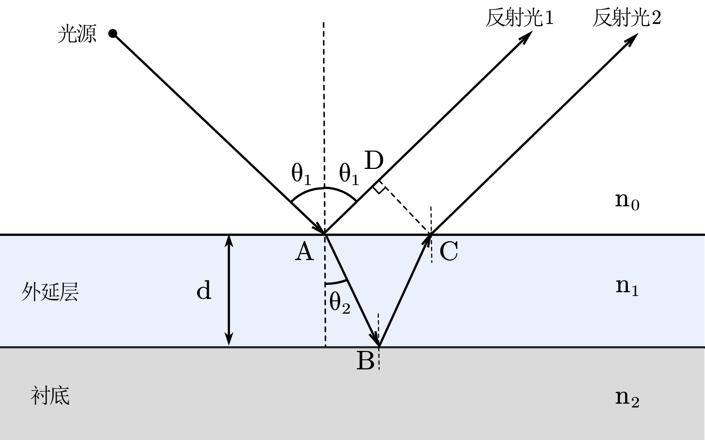
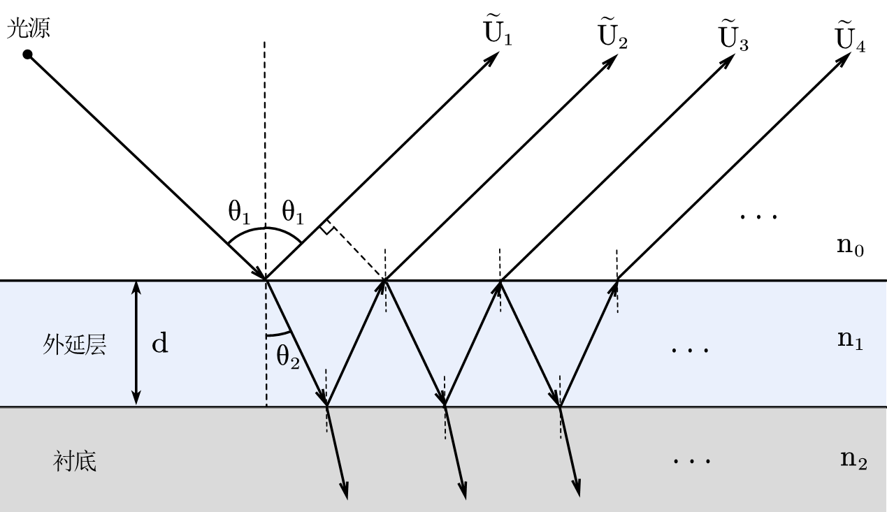
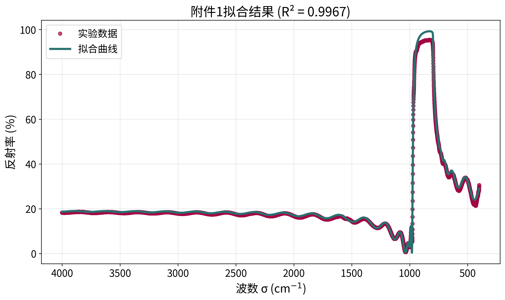
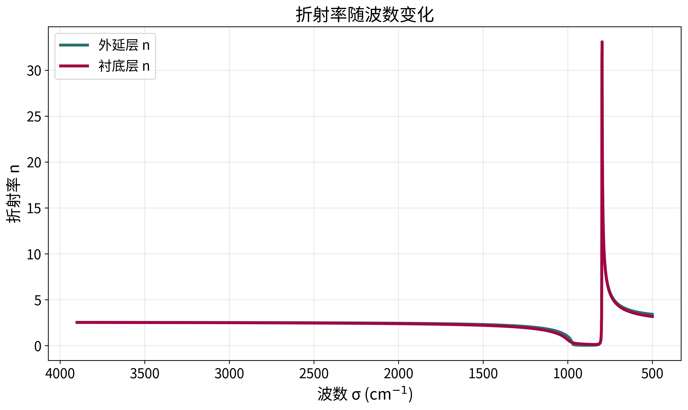
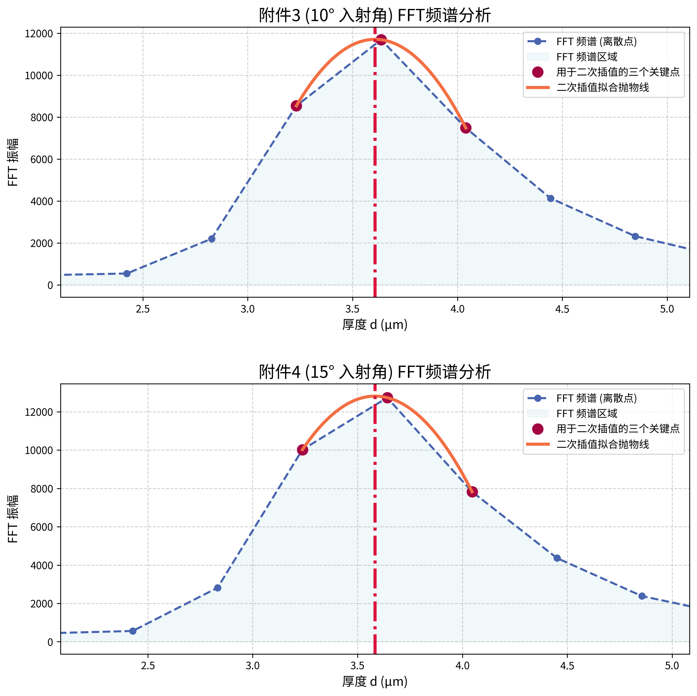
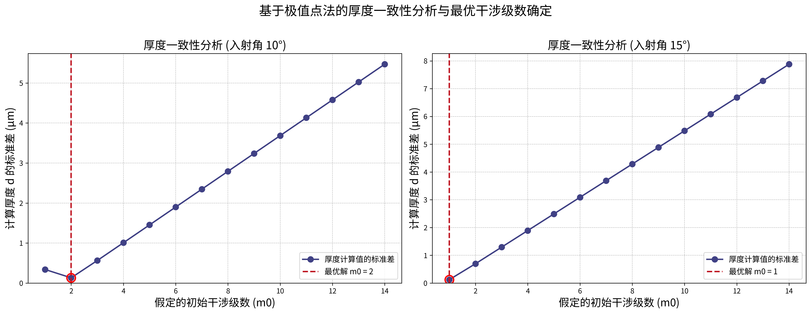

# 2025 CUMCM Problem B — National First Prize

> 2025 全国大学生数学建模竞赛 B 题 · 全国一等奖
> *China Undergraduate Mathematical Contest in Modeling (CUMCM) 2025, Problem B — National First Prize.*

**红外干涉法测量半导体外延层厚度 / Measuring semiconductor epitaxial-layer thickness by infrared interferometry.**

---

## 中文

### 项目简介
本仓库收录 2025 年全国大学生数学建模竞赛 B 题的参赛论文、求解代码与全部图表。题目要求基于红外反射光谱，建立外延层厚度的数学模型并设计求解算法。我们从菲涅尔方程与材料色散出发，构建了双光束 / 多光束干涉模型，并配合全局—局部混合优化、干涉极值解析以及色散校正傅里叶变换等算法，分别对碳化硅（SiC）与硅（Si）晶圆片完成了高精度厚度反演。

### 赛题与研究目标
- **问题一**：仅考虑一次反射 / 透射，建立"空气–外延层–衬底"三层结构的双光束干涉模型，并刻画与波长、载流子浓度相关的折射率色散。
- **问题二**：基于问题一的模型设计算法，用附件实测光谱反演 SiC 外延层厚度及相关物理参数。
- **问题三**：引入多光束干涉，推导其发生的必要条件并判断 Si 晶圆片是否发生多光束干涉；重建厚度模型与算法求解 Si 外延层厚度，并分析多光束干涉对计算精度的影响，进而消除其对问题一、二结果的潜在影响。

### 核心方法与图像
我们针对碳化硅（SiC）与硅（Si）两类材料、三个递进问题，建立了完整的"物理建模 → 参数反演 → 精度校验"求解链路。

**问题一 · 物理建模**
- 在"空气–外延层–衬底"三层结构上建立双光束干涉模型，用菲涅尔方程分别处理 s/p 偏振的反射与透射；
- 针对 SiC 的色散，引入同时刻画**晶格振动**与**自由载流子**的洛伦兹–德鲁德（Lorentz–Drude）模型，得到随波数变化的复折射率，代入干涉模型即可重建全波段（400–4000 cm⁻¹）反射光谱。

**问题二 · SiC 外延层厚度反演**
- 将问题转化为 7 参数逆问题（外延层厚度、纵/横声子阻尼、外延层与衬底的等离子体频率与阻尼）；
- 采用"差分进化（全局搜索，种群 40、迭代 1000、固定随机种子 42）+ L-BFGS-B（局部精修，容差 `1e-12`）"两步混合优化，避免陷入局部极值；
- 剔除首个非物理数据点（反射率 R=0）后拟合，10°/15° 两组光谱决定系数 R² 分别达 **0.9967 / 0.9948**，厚度 **7.413 µm**；
- 由拟合折射率验证外延层与衬底高度匹配，反过来证明该体系多光束干涉可忽略、双光束模型充分。

**问题三 · Si 晶圆片厚度反演与多光束分析**
- 推导多光束干涉发生的三个必要条件：相干长度 `L_c ≫ 2nd·cosθ`、相邻反射光振幅比 `|r₁′r₂e^{−iδ}|` 不可过小、界面平行光滑且膜厚均匀；
- 先用**干涉极值点解析法**（结合三项塞尔迈耶方程描述 Si 折射率，并以遍历搜索确定干涉级数）求得 **3.751 µm**；再由菲涅尔系数定量算出各级反射光振幅与光谱精细度 `F ≈ 2.7 > 2`，严格证明 Si 存在多光束干涉；
- 作为核心创新，构建**带色散校正的傅里叶变换法**（详见下节"主要创新点"），得到更稳健的最终厚度 **3.595 µm**。

<table>
  <tr>
    <td align="center" width="50%"><br/><sub>双光束干涉光路 · Two-beam optical path（问题一）</sub></td>
    <td align="center" width="50%"><br/><sub>多光束干涉光路 · Multi-beam optical path（问题三）</sub></td>
  </tr>
  <tr>
    <td align="center" width="50%"><br/><sub>SiC 光谱拟合 · Spectral fit, R²≈0.997（问题二）</sub></td>
    <td align="center" width="50%"><br/><sub>折射率色散 · Refractive-index dispersion</sub></td>
  </tr>
  <tr>
    <td align="center" width="50%"><br/><sub>色散校正 FFT 频谱 · Dispersion-corrected FFT（问题三）</sub></td>
    <td align="center" width="50%"><br/><sub>厚度一致性分析 · Thickness consistency</sub></td>
  </tr>
</table>

### 主要创新点
1. **多角度全局同步拟合**：用同一组参数同时拟合 10° 与 15° 光谱，抑制多参数逆问题的解不唯一性。
2. **色散校正的傅里叶变换（旗舰创新）**：通过坐标变换 `x(σ)=2σ√(n_f²−sin²θ)` 将非线性相位线性化、使信号真正周期化，从根源消除直接 FFT 的色散系统误差。
3. **可量化的多光束判据**：基于菲涅尔系数的"振幅比 + 精细度"判据，证明 Si 存在多光束、SiC 可忽略。
4. **材料定制化色散建模**：SiC 用洛伦兹–德鲁德模型、Si 用三项塞尔迈耶方程。
5. **全面校验**：交叉角度一致性、灵敏度分析与蒙特卡洛稳定性检验。

### 主要结果
| 样品 | 方法 | 厚度 | 拟合优度 / 备注 |
| --- | --- | --- | --- |
| SiC 外延层（问题二） | 双光束干涉 + 全局–局部混合优化 | **7.413 µm** | R² = 0.9967（10°）/ 0.9948（15°）；多光束干涉可忽略 |
| Si 晶圆片（问题三） | 干涉极值点解析法 | **3.751 µm** | d₃ = 3.7504 µm（10°）、d₄ = 3.7520 µm（15°）取均值 |
| Si 晶圆片（问题三） | 色散校正 FFT | **3.595 µm** | d₃ = 3.6070 µm（10°）、d₄ = 3.5833 µm（15°）取均值 |

先进行定性分析，之后通过精细度 `F ≈ 2.7` 定量证明 Si 晶圆片存在多光束干涉；灵敏度与稳定性（蒙特卡洛）检验进一步验证了模型的稳健性。

### 仓库结构
```text
CUMCM-2025-Problem-B/
├── 25_国赛/
│   ├── main.tex                 # 论文主文件（XeLaTeX / ctexart）
│   ├── example.tex              # 模板示例
│   ├── cite.bib                 # 参考文献数据库
│   ├── gbt7714.sty              # 国标 GB/T 7714 引用宏包
│   ├── gbt7714-numerical.bst    # 国标数字引用样式
│   ├── img/                     # 论文全部图像（.png / .svg）
│   └── code/                    # Python 求解源码
│       ├── q2.py                # 问题二：混合优化同步拟合
│       ├── q3-interfere.py      # 问题三：干涉极值点解析法
│       ├── q3-fft.py            # 问题三：色散校正傅里叶变换
│       └── q2-example.py        # 辅助 / 示例脚本
├── README.md
└── .gitignore
```

### 运行方式
**环境配置**（推荐从仓库根目录运行）：
```bash
python -m venv .venv
source .venv/bin/activate
pip install -r requirements.txt
```

**编译论文**（需 TeX Live，含 XeLaTeX 与 ctex）：
```bash
cd 25_国赛
latexmk -xelatex -shell-escape main.tex   # 生成 main.pdf
```

**运行求解代码**（Python 3.9+）：
```bash
cd 25_国赛/code
python q2.py            # 问题二
python q3-interfere.py  # 问题三（极值法）
python q3-fft.py        # 问题三（FFT 法）
```
> 注：求解脚本读取赛题附件中的实测光谱。当前仓库保留了 `题目以及原始数据/附件/` 下的文件名称。该数据归赛事主办方所有，未随仓库分发，运行前需自行将数据替换为真实数据。


### 获奖信息
- **赛事**：2025 全国大学生数学建模竞赛（CUMCM），中国工业与应用数学学会（CSIAM）主办。
- **题目**：B 题 —— 碳化硅外延层厚度的红外干涉测量。
- **奖项**：**全国一等奖（National First Prize）**。

### 引用与许可证说明
如在研究或项目中参考本工作，欢迎按如下方式引用：
```bibtex
@misc{cumcm2025problemB,
  title  = {Infrared Interferometric Measurement of Semiconductor Epitaxial-Layer Thickness
            (2025 CUMCM Problem B, National First Prize)},
  year   = {2025},
  note   = {China Undergraduate Mathematical Contest in Modeling, Problem B},
  howpublished = {GitHub repository}
}
```
**许可证（建议）**：源代码建议以 [MIT](https://opensource.org/licenses/MIT) 许可发布；论文文本与图表建议以 [CC BY-NC-SA 4.0](https://creativecommons.org/licenses/by-nc-sa/4.0/) 许可发布。赛题原始附件数据版权归赛事主办方所有，不在本仓库授权范围内。请按需在仓库根目录添加 `LICENSE` 文件以最终确认授权条款。

---

## English

### Overview
This repository contains the contest paper, solver code, and all figures for **Problem B of the 2025 China Undergraduate Mathematical Contest in Modeling (CUMCM)**. The task is to model and compute the thickness of a semiconductor epitaxial layer from its infrared reflectance spectrum. Starting from the Fresnel equations and material dispersion, we build two-beam and multi-beam interference models and combine global–local optimization, interference-extremum analysis, and a dispersion-corrected Fourier transform to recover the thicknesses of silicon-carbide (SiC) and silicon (Si) wafers with high precision.

### Problem & Research Goals
- **Problem 1** — Considering only a single reflection/transmission, build a two-beam interference model for the *air–epilayer–substrate* stack, with a refractive index that depends on wavelength and carrier concentration.
- **Problem 2** — Design an algorithm on top of the Problem 1 model and invert the SiC epilayer thickness (and related physical parameters) from the measured spectra.
- **Problem 3** — Introduce multi-beam interference, derive the necessary conditions for it, decide whether the Si wafer exhibits it, rebuild the thickness model accordingly, and analyze (and remove) its impact on the precision of Problems 1–2.

### Core Methods & Figures
We built a full *physical modeling → parameter inversion → accuracy validation* pipeline across two materials (SiC and Si) and three progressive problems.

**Problem 1 · Physical modeling**
- A two-beam interference model on the *air–epilayer–substrate* stack, with Fresnel equations handling s-/p-polarized reflection and transmission;
- A Lorentz–Drude dispersion model for SiC capturing both **lattice vibration** and **free carriers**, yielding a wavenumber-dependent complex refractive index that reconstructs the full-band (400–4000 cm⁻¹) reflectance spectrum.

**Problem 2 · SiC epilayer inversion**
- Cast as a 7-parameter inverse problem (thickness, longitudinal/transverse phonon damping, plasma frequency and damping of both epilayer and substrate);
- A two-step hybrid optimizer — *Differential Evolution* (global; population 40, 1000 iterations, fixed seed 42) + *L-BFGS-B* (local refinement, tolerance `1e-12`) — avoids local minima;
- After dropping the first non-physical point (R=0), the 10°/15° fits reach R² = **0.9967 / 0.9948**, giving **7.413 µm**;
- The fitted refractive indices show epilayer–substrate matching, which in turn proves multi-beam interference is negligible and the two-beam model is sufficient.

**Problem 3 · Si wafer inversion & multi-beam analysis**
- Derived three necessary conditions for multi-beam interference: coherence length `L_c ≫ 2nd·cosθ`, a not-too-small adjacent-amplitude ratio `|r₁′r₂e^{−iδ}|`, and parallel/smooth interfaces with uniform thickness;
- An **interference-extremum analytic method** (Si dispersion via a three-term Sellmeier equation, interference order fixed by grid search) gives **3.751 µm**; Fresnel-coefficient calculation of per-order amplitudes and a spectral finesse `F ≈ 2.7 > 2` then rigorously prove multi-beam interference in Si;
- As the flagship innovation, a **dispersion-corrected Fourier transform** (see *Key Innovations* below) yields the more robust final thickness **3.595 µm**.

*(Figures with bilingual captions are shown in the gallery in the Chinese section above.)*

### Key Innovations
1. **Multi-angle global synchronous fitting** — one shared parameter set fits both the 10° and 15° spectra, suppressing the non-uniqueness of the multi-parameter inverse problem.
2. **Dispersion-corrected FFT (flagship)** — a coordinate transform `x(σ)=2σ√(n_f²−sin²θ)` linearizes the phase so the signal becomes truly periodic, removing the dispersion-induced systematic error of a direct FFT at its root.
3. **A quantitative multi-beam criterion** — an amplitude-ratio-plus-finesse test from Fresnel coefficients proves multi-beam interference for Si and shows it is negligible for SiC.
4. **Material-specific dispersion modeling** — Lorentz–Drude for SiC, a three-term Sellmeier equation for Si.
5. **Comprehensive validation** — cross-angle consistency, sensitivity analysis, and Monte-Carlo stability tests.

### Main Results
| Sample | Method | Thickness | Goodness of fit / Notes |
| --- | --- | --- | --- |
| SiC epilayer (P2) | Two-beam + hybrid global–local optimization | **7.413 µm** | R² = 0.9967 (10°) / 0.9948 (15°); multi-beam negligible |
| Si wafer (P3) | Interference-extremum analysis | **3.751 µm** | mean of d₃ = 3.7504 µm (10°) and d₄ = 3.7520 µm(15°) |
| Si wafer (P3) | Dispersion-corrected FFT (final) | **3.595 µm** | mean of d₃ = 3.6070 µm (10°) and d₄ = 3.5833 µm (15°) |

A finesse of `F ≈ 2.7` quantitatively confirms multi-beam interference in the Si wafer; sensitivity and Monte-Carlo stability tests further validate the robustness of the models.

### Repository Layout
See the tree in the Chinese section above: `25_国赛/` holds the paper source (`main.tex`), bibliography and GB/T 7714 citation style, with `img/` (figures) and `code/` (Python solvers `q2.py`, `q3-interfere.py`, `q3-fft.py`).

### How to Run
Reproduce the code results from the repository root:
```bash
python -m venv .venv
source .venv/bin/activate
pip install -r requirements.txt

python reproduce.py            # fast check: P2 reported parameters + both P3 solvers
python reproduce.py --full-q2  # full P2 global-local optimization, slower
```
Generated figures are written to `25_国赛/code/outputs/`. The scripts resolve the contest attachments automatically from either `25_国赛/code/attach/1.xlsx` or the bundled `题目以及原始数据/附件/附件1.xlsx` layout.

Compile the paper (TeX Live with XeLaTeX + ctex):
```bash
cd 25_国赛
latexmk -xelatex -shell-escape main.tex   # produces main.pdf
```
Run the solvers (Python 3.9+):
```bash
pip install -r requirements.txt
cd 25_国赛/code
python q2.py            # Problem 2
python q3-interfere.py  # Problem 3 (extremum method)
python q3-fft.py        # Problem 3 (FFT method)
```
> Note: the solvers read the measured spectra from the contest attachments. This repository currently keeps a copy under `题目以及原始数据/附件/` for reproducibility; if that data is removed in a redistributed copy, place `1.xlsx` to `4.xlsx` under `25_国赛/code/attach/`.

### Award
- **Contest** — 2025 China Undergraduate Mathematical Contest in Modeling (CUMCM), organized by CSIAM.
- **Problem** — Problem B: Infrared interferometric measurement of silicon-carbide epitaxial-layer thickness.
- **Award** — **National First Prize.**

### Citation & License
Please cite via the BibTeX entry given in the Chinese section above.
**Suggested license:** release the source code under the [MIT License](https://opensource.org/licenses/MIT) and the paper text and figures under [CC BY-NC-SA 4.0](https://creativecommons.org/licenses/by-nc-sa/4.0/). The original contest attachment data remains the property of the organizers and is not covered by this repository's license. Add a `LICENSE` file at the repository root to finalize the terms.
