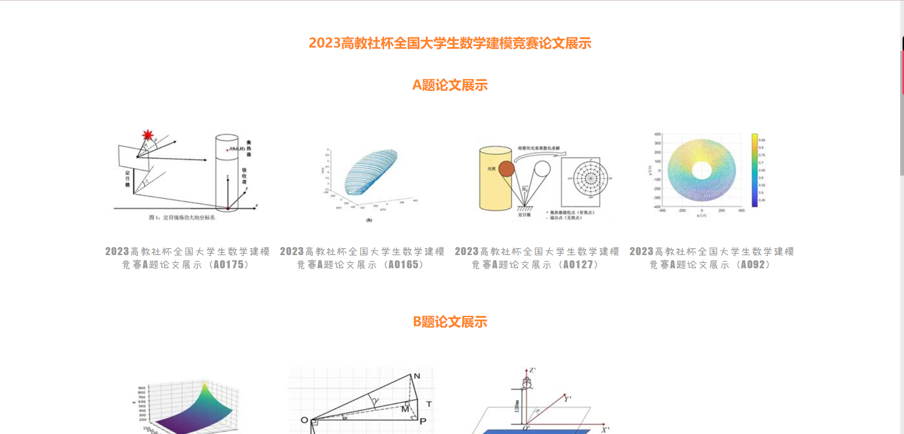
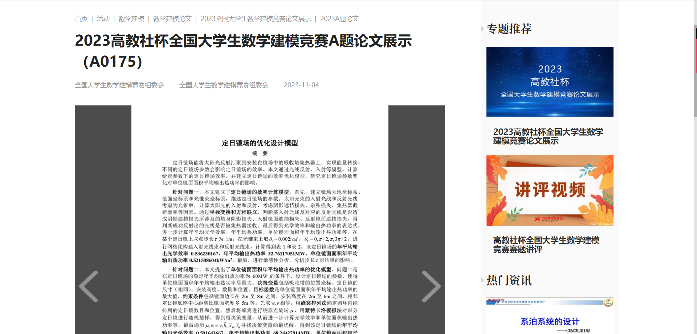
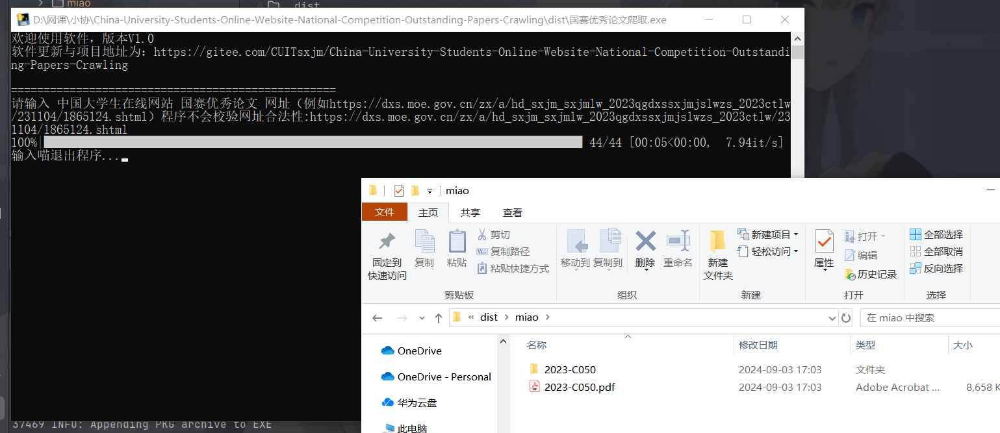

# 项目介绍

在中国大学生在线网站中，有关于全国大学生数学建模竞赛的优秀论文[展示](https://dxs.moe.gov.cn/zx/hd/sxjm/sxjmlw/qkt_sxjm_lw_lwzs.shtml)，下面介个样子


比如说点进去后，是每一道题的优秀论文，下面介个亚子



再往里面点就是论文了，比如说[2023高教社杯全国大学生数学建模竞赛A题论文展示（A0175）](https://dxs.moe.gov.cn/zx/a/hd_sxjm_sxjmlw_2023qgdxssxjmjslwzs_2023atlw/231104/1865114.shtml)，下面介个亚子



但是是图片形式的，非常不利于学习，因此开发了一个小玩意喵

# 使用方式

## 直接使用软件

- [这里](https://gitee.com/CUITsxjm/China-University-Students-Online-Website-National-Competition-Outstanding-Papers-Crawling/releases)下载最新版`exe`
- 双击打开
- 输入网址，注意一定要是具体的一篇论文的网址，比如说https://dxs.moe.gov.cn/zx/a/hd_sxjm_sxjmlw_2023qgdxssxjmjslwzs_2023atlw/231104/1865114.shtml
- 按回车，期待结果



## 要用源代码

- [点击](https://gitee.com/CUITsxjm/China-University-Students-Online-Website-National-Competition-Outstanding-Papers-Crawling/blob/master/%E5%9B%BD%E8%B5%9B%E4%BC%98%E7%A7%80%E8%AE%BA%E6%96%87%E7%88%AC%E5%8F%96.py)下载
- 使用`pip`命令安装依赖后运行代码即可

```cmd
pip install -i https://pypi.tuna.tsinghua.edu.cn/simple img2pdf
pip install -i https://pypi.tuna.tsinghua.edu.cn/simple requests
pip install -i https://pypi.tuna.tsinghua.edu.cn/simple tqdm
pip install -i https://pypi.tuna.tsinghua.edu.cn/simple lxml
```

# 版本更新

## V1.0

- 20240903
- 万物的开始

## V1.1

- 20240903
- 优化提取图片的方式，使用更加通用的`xpath`定位图片元素，而不是正则表达式

## V1.2

- 20250825
- 修复了合并`pdf`时顺序错误的`bug`